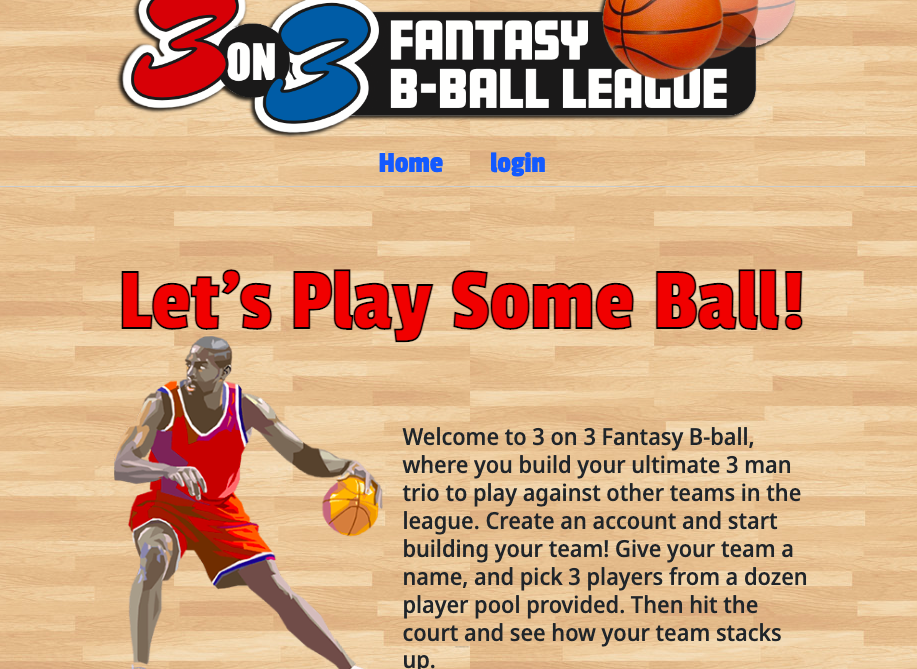

# uclaFantasyLeague

UCLA Fantasy League is a 3 on 3 fantasy leauge where users can choose teams and compete against other users!

## Contributing

Brian Allison
Vanessa Chan
Jonathan Fregoso
William Voigt
Gil Young

## Technologies Used

HTML
Handlebars
CSS
Javascript
Node.js
MySQL

## Future Developement 

In the future we hope to build in a third party API to import real time stats. This will allow users to choose from a larger ammount of players and make more complicated decisions. 

We hope to be able to show the users their player stats in the dashboard with live updates as NBA games progress.

We want users teams to have a 24 hours life-span and to be prompted to make a new team once their old one expires.

We want to add functionality that tracks users wins and losses.

## License

[MIT](https://choosealicense.com/licenses/mit/)